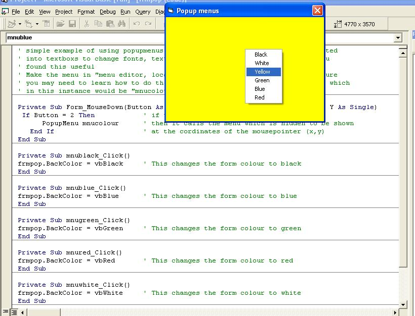



## \[popup menu made simple\]

### Description

Popmenu for beginners, shows great example of how to implement a popup menu into your program, from this example you should be able to add popup menus to which ever control you wish, hope this provides use to sombody.
 
### More Info
 

             |
---                |---
**Submitted On**   |2004-08-17 09:55:10
**By**             |[Ste Dunn](https://github.com/Planet-Source-Code/PSCIndex/blob/master/ByAuthor/ste-dunn.md)
**Level**          |Beginner
**User Rating**    |4.3 (51 globes from 12 users)
**Compatibility**  |VB 5\.0, VB 6\.0
**Category**       |[Custom Controls/ Forms/  Menus](https://github.com/Planet-Source-Code/PSCIndex/blob/master/ByCategory/custom-controls-forms-menus__1-4.md)
**World**          |[Visual Basic](https://github.com/Planet-Source-Code/PSCIndex/blob/master/ByWorld/visual-basic.md)
**Archive File**   |[\[popup\_men1782798172004\.zip](https://github.com/Planet-Source-Code/ste-dunn-popup-menu-made-simple__1-55630/archive/master.zip)

